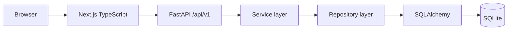

# Architecture

Recall is a modular monolith: a Next.js client calls a versioned FastAPI REST API, whose routers delegate to services and repositories backed by SQLite/SQLAlchemy. This keeps local deployment and interview comprehension simple while retaining replaceable boundaries.

Routes validate HTTP contracts; services own transactions and business workflows; repositories own query composition. The frontend keeps requests in `services/api.ts`, cached with TanStack Query.
