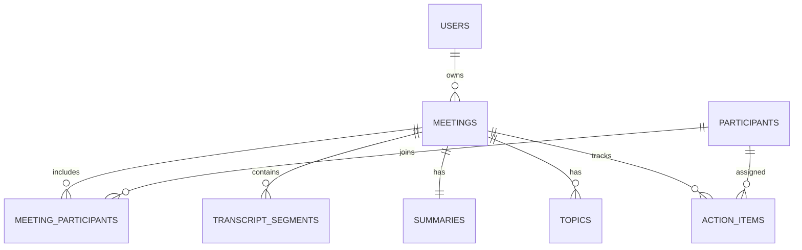

# Database schema

`meetings` stores metadata only. Large, independently queried data lives in related tables.

Important indexes: `(meeting_id, start_time_ms)` supports ordered transcript retrieval, `(owner_id, occurred_at)` supports library recency, and `(meeting_id, status)` supports action-item panels. Timestamps within transcripts are integer milliseconds to avoid floating-point seek drift.
